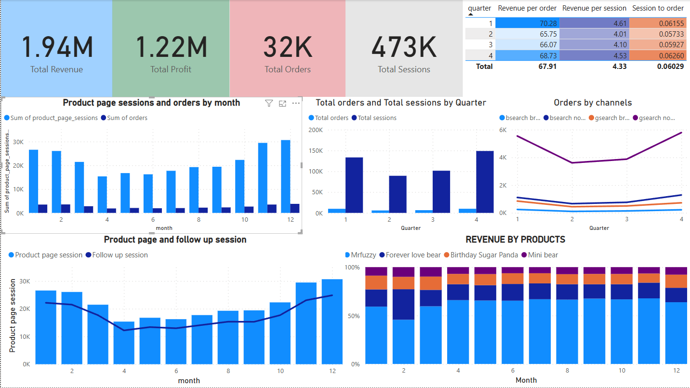

**1. Project overview**
- Helping an e-commerce company to analyse operational data related to website traffic and user behavior. My goal is to extract, analyze, and craft a compelling data-driven story that reflects the company’s progress and future potential.

**2. Dataset description**
- order_item_refunds table : Contains information about the amount refunded for products in orders.
- order_items table        : Contains information about the products in orders.
- orders table             : Contains information about the orders.
- products table           : Contains information about the products.
- website_pageviews table  : Contains information about the pageviews.
- website_sessions table   : Contains information about website access sessions.

**3. Project workflow**
 - Analyze growth in Website Traffic and Orders over time
 - Evaluate operational efficiency metrics
 - Evaluate growth in different Customer Acquisition Channels
 - Evaluate Conversion Rate Trends by Channel
 - Evaluate Revenue and Profitability by Product
 - Measured the impact of newly introduced products
 - Evaluate the effectiveness of product bundling was assessed by examining product pairs sold together, especially post-launch of a new main product

**4. Visualisation**
**
**

**5. Insights**
- Gross profit margin of 63% indicate a strong, healthy business
- Quarter 4 witnessed peak traffic and conversion rate, followed up by quarter 1, while quarter 2 considered weakest
- Google search without brandname dominates about 70-75% orders per quarter while branded search, email, social & referrals stay < 10 % each and all bottomed in Q2.
- Product-page sessions drop steadily from Jan to May then climb back, mirroring overall traffic, Follow-up sessions (return visits) fall faster and stay flatter gap widens mid year.
### 🧸 Product Revenue Overview

| Product              | Share of Revenue (est.) | Trend                                |
|----------------------|-------------------------|--------------------------------------|
| Mr Fuzzy             | ≈ 65 – 70%              | Stable – cash-cow, but concentration risk |
| Forever Love Bear    | 15%                     | Slight decline mid-year              |
| Birthday Sugar Panda | 8%                      | Flat                                 |
| Mini Bear            | 5%                      | Flat                                 |

